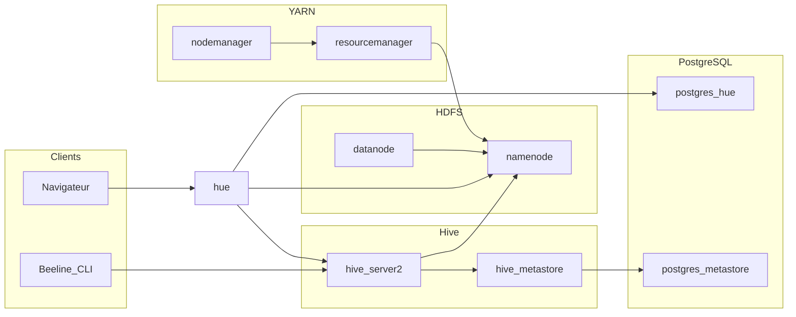

# TP4 — Apache Hive sur HDFS avec Hue (Docker)

**Cours :** Big Data et analyse de données  
**Niveau :** Licence 3 IAGE — ISI  
**Année universitaire :** 2025-2026  
**Version du document :** 1.3

---

## 1. Objectifs pédagogiques

À l’issue de ce TP, vous devez être capable de :

- déployer localement un **mini-cluster** Hadoop (HDFS, YARN) complété par **Apache Hive** (metastore + HiveServer2) et l’interface **Hue** ;
- comprendre le rôle du **metastore** (ici backed par **PostgreSQL**) et celui de **HiveServer2** pour l’exécution de requêtes SQL ;
- préparer le **warehouse** Hive sur HDFS et **charger** des fichiers texte (TSV ou CSV) ;
- créer des **tables** Hive (gérées ou externes) et exécuter des requêtes d’**agrégation** et de filtrage ;
- (bonus) exprimer en **HiveQL** une logique équivalente au job MapReduce *TotalSalesByCategory* du TP2.

Les fichiers de référence du dépôt pour ce TP se trouvent sous [`tp4/hadoop-hive-hue/`](hadoop-hive-hue/) : [`docker-compose.yml`](hadoop-hive-hue/docker-compose.yml), [`hue/hue.ini`](hadoop-hive-hue/hue/hue.ini) et [`Dockerfile.hive`](hadoop-hive-hue/Dockerfile.hive). Leur **contenu intégral** est également reproduit en **section 4** (copie à maintenir alignée sur le dépôt).

---

## 2. Prérequis

### 2.1 Minimum (toute machine hôte)

- **Docker Engine** et **Docker Compose V2** (plugin officiel : commande `docker compose`, pas seulement le binaire `docker-compose` autonome).
- Ressources machine : plusieurs conteneurs Java/Hadoop tournent en parallèle — prévoir **au moins 8 Go de RAM** disponibles pour Docker si possible.
- Notions de **SQL** et rappels du [TP2](../tp2.html) sur le format tabulé de `purchases.txt` (ville, catégorie, montant, moyen de paiement).

### 2.2 Référence VM Ubuntu (alignée sur `history.txt`)

L’environnement de référence du TP a été préparé sur une **VM Ubuntu** (journal shell conservé dans [`tp4/history.txt`](history.txt)). Les étapes ci-dessous condensent l’installation **Docker** via le dépôt officiel, comme dans cet historique (hors parties données externes non reprises ici).

```bash
sudo apt update
sudo apt install -y ca-certificates curl gnupg lsb-release

sudo mkdir -p /etc/apt/keyrings
curl -fsSL https://download.docker.com/linux/ubuntu/gpg | sudo gpg --dearmor -o /etc/apt/keyrings/docker.gpg
sudo chmod a+r /etc/apt/keyrings/docker.gpg

echo "deb [arch=$(dpkg --print-architecture) signed-by=/etc/apt/keyrings/docker.gpg] \
https://download.docker.com/linux/ubuntu $(lsb_release -cs) stable" \
| sudo tee /etc/apt/sources.list.d/docker.list > /dev/null

sudo apt update
sudo apt install -y docker-ce docker-ce-cli containerd.io docker-compose-plugin
```

Puis ajoutez votre utilisateur au groupe `docker` (équivalent à `sudo usermod -aG docker $USER` dans l’historique) :

```bash
sudo usermod -aG docker "$USER"
```

**Important :** fermez la session SSH ou déconnectez-vous du bureau, puis reconnectez-vous (ou redémarrez) pour que le groupe `docker` soit pris en compte avant d’exécuter `docker compose` sans `sudo`.

**Optionnel (toujours sur Ubuntu, utile si vous manipulez des archives `.zip`) :**

```bash
sudo apt install -y unzip
```

Les fichiers `docker-compose.yml` et `hue.ini` ont été édités avec **`nano`** dans la même trace ; tout éditeur texte convient.

---

## 3. Architecture de la stack

Les services définis dans le Compose communiquent sur un réseau Docker `hadoop-net`. Les ports exposés sur la machine hôte permettent d’accéder aux interfaces web et au JDBC Hive.



**Ports utiles (hôte)** — à adapter si vous modifiez le fichier Compose :

| Service            | Port(s) | Usage |
|--------------------|---------|--------|
| Namenode (HDFS UI) | 9870    | http://localhost:9870 |
| HDFS RPC           | 9000    | URI `hdfs://namenode:9000` (interne au réseau Docker) |
| ResourceManager    | 8088    | http://localhost:8088 |
| HiveServer2 JDBC   | 10000   | Beeline, clients JDBC |
| HiveServer2 Web UI | 10002   | http://localhost:10002 |
| Hue                | 8888    | http://localhost:8888 |
| Postgres metastore | 5433    | debug JDBC depuis l’hôte |
| Postgres Hue       | 5434    | debug JDBC depuis l’hôte |

---

## 4. Fichiers de la stack (contenu intégral)

Ci-dessous, **copie** des fichiers présents dans le dépôt sous `tp4/hadoop-hive-hue/`. En cas de divergence avec votre copie locale, **les fichiers du dépôt font foi** ; toute modification dans le dépôt doit être **reproduite ici manuellement** pour garder l’énoncé aligné.

### 4.1 `Dockerfile.hive`

```dockerfile
# Image Hive 4.2.0 avec pilote JDBC PostgreSQL pour le metastore distant.
# Construction : depuis ce répertoire (tp4/hadoop-hive-hue)
#   docker build -f Dockerfile.hive -t hive-with-postgres:4.2.0 .
#
# L’image officielle apache/hive n’embarque pas le JAR Postgres dans le classpath
# attendu par schematool / metastore lorsque javax.jdo utilise org.postgresql.Driver.

FROM apache/hive:4.2.0

USER root

ARG PG_JDBC_VERSION=42.7.4
ADD "https://jdbc.postgresql.org/download/postgresql-${PG_JDBC_VERSION}.jar" \
    /opt/hive/lib/postgresql-jdbc.jar
RUN chown hive:hive /opt/hive/lib/postgresql-jdbc.jar

USER hive
```

### 4.2 `docker-compose.yml`

```yaml
services:
  postgres-metastore:
    image: postgres:16-alpine
    container_name: postgres-metastore
    environment:
      POSTGRES_DB: metastore_db
      POSTGRES_USER: hive
      POSTGRES_PASSWORD: hivepassword
    volumes:
      - postgres-metastore-data:/var/lib/postgresql/data
    ports:
      - "5433:5432"
    networks:
      - hadoop-net
    restart: unless-stopped

  postgres-hue:
    image: postgres:16-alpine
    container_name: postgres-hue
    environment:
      POSTGRES_DB: hue_db
      POSTGRES_USER: hue
      POSTGRES_PASSWORD: huepassword
    volumes:
      - postgres-hue-data:/var/lib/postgresql/data
    ports:
      - "5434:5432"
    networks:
      - hadoop-net
    restart: unless-stopped

  namenode:
    image: bde2020/hadoop-namenode:2.0.0-hadoop3.2.1-java8
    container_name: namenode
    hostname: namenode
    environment:
      CLUSTER_NAME: test
      CORE_CONF_fs_defaultFS: hdfs://namenode:9000
      CORE_CONF_hadoop_proxyuser_hue_hosts: "*"
      CORE_CONF_hadoop_proxyuser_hue_groups: "*"
      HDFS_CONF_dfs_webhdfs_enabled: "true"
      HDFS_CONF_dfs_namenode_datanode_registration_ip___hostname___check: "false"
    volumes:
      - namenode-data:/hadoop/dfs/name
      - ./transactions:/transactions
    ports:
      - "9870:9870"   # HDFS Web UI
      - "9000:9000"   # RPC
    networks:
      - hadoop-net
    restart: unless-stopped

  datanode:
    image: bde2020/hadoop-datanode:2.0.0-hadoop3.2.1-java8
    container_name: datanode
    hostname: datanode
    environment:
      CLUSTER_NAME: test
      CORE_CONF_fs_defaultFS: hdfs://namenode:9000
    volumes:
      - datanode-data:/hadoop/dfs/data
    ports:
      - "9864:9864"
    networks:
      - hadoop-net
    depends_on:
      - namenode
    restart: unless-stopped

  resourcemanager:
    image: bde2020/hadoop-resourcemanager:2.0.0-hadoop3.2.1-java8
    container_name: resourcemanager
    hostname: resourcemanager
    environment:
      CLUSTER_NAME: test
      CORE_CONF_fs_defaultFS: hdfs://namenode:9000
      CORE_CONF_hadoop_proxyuser_hue_hosts: "*"
      CORE_CONF_hadoop_proxyuser_hue_groups: "*"
    ports:
      - "8088:8088"   # YARN Web UI
      - "8032:8032"
    networks:
      - hadoop-net
    depends_on:
      - namenode
      - datanode
    restart: unless-stopped

  nodemanager:
    image: bde2020/hadoop-nodemanager:2.0.0-hadoop3.2.1-java8
    container_name: nodemanager
    hostname: nodemanager
    environment:
      CLUSTER_NAME: test
      CORE_CONF_fs_defaultFS: hdfs://namenode:9000
      CORE_CONF_hadoop_proxyuser_hue_hosts: "*"
      CORE_CONF_hadoop_proxyuser_hue_groups: "*"
    ports:
      - "8042:8042"
    networks:
      - hadoop-net
    depends_on:
      - resourcemanager
    restart: unless-stopped

  hive-metastore:
    image: hive-with-postgres:4.2.0
    container_name: hive-metastore
    command: ["--service", "metastore"]
    environment:
      SERVICE_NAME: metastore
      DB_DRIVER: postgres
      SERVICE_OPTS: >
        -Djavax.jdo.option.ConnectionDriverName=org.postgresql.Driver
        -Djavax.jdo.option.ConnectionURL=jdbc:postgresql://postgres-metastore:5432/metastore_db
        -Djavax.jdo.option.ConnectionUserName=hive
        -Djavax.jdo.option.ConnectionPassword=hivepassword
    volumes:
      - hive-warehouse:/opt/hive/data/warehouse
    depends_on:
      - postgres-metastore
    networks:
      - hadoop-net
    restart: unless-stopped

  hive-server2:
    image: hive-with-postgres:4.2.0
    container_name: hive-server2
    command: ["--service", "hiveserver2"]
    environment:
      SERVICE_NAME: hiveserver2
      SERVICE_OPTS: >
        -Dhive.metastore.uris=thrift://hive-metastore:9083
        -Dhive.execution.engine=tez
        -Dhadoop.fs.defaultFS=hdfs://namenode:9000
        -Dfs.defaultFS=hdfs://namenode:9000
    ports:
      - "10000:10000"   # Thrift / JDBC
      - "10002:10002"   # HiveServer2 Web UI
    volumes:
      - hive-warehouse:/opt/hive/data/warehouse
    depends_on:
      - hive-metastore
      - resourcemanager
    networks:
      - hadoop-net
    restart: unless-stopped

  hue:
    image: gethue/hue:latest
    container_name: hue
    ports:
      - "8888:8888"
    volumes:
      - ./hue/hue.ini:/usr/share/hue/desktop/conf/hue.ini:ro
    depends_on:
      - hive-server2
      - postgres-hue
    networks:
      - hadoop-net
    restart: unless-stopped

volumes:
  postgres-metastore-data:
  postgres-hue-data:
  namenode-data:
  datanode-data:
  hive-warehouse:

networks:
  hadoop-net:
    driver: bridge
```

### 4.3 `hue/hue.ini`

```ini
[desktop]
[[database]]
engine=postgresql_psycopg2
host=postgres-hue
port=5432
user=hue
password=huepassword
name=hue_db

[hadoop]
[[hdfs_clusters]]
[[[default]]]
fs_defaultfs=hdfs://namenode:9000
webhdfs_url=http://namenode:9870/webhdfs/v1

[beeswax]
# Obligatoire
hive_server_host=hive-server2
hive_server_port=10000

# Très utile en Docker
hive_conf_dir=/etc/hive/conf
server_connect_timeout=120
# Option pour forcer le rafraîchissement
# query_settings={\"hive.execution.engine\":\"tez\"}

[notebook]
[[interpreters]]
[[[hive]]]
name=Hive
interface=hiveserver2
options='{"url": "http://hive-server2:10000", "driver": "hive"}'
```

---

## 5. Construction de l’image Hive (`hive-with-postgres:4.2.0`)

Le fichier [`Dockerfile.hive`](hadoop-hive-hue/Dockerfile.hive) part de l’image officielle **`apache/hive:4.2.0`** et ajoute le pilote **JDBC PostgreSQL** dans `/opt/hive/lib/`, nécessaire lorsque le metastore est configuré avec `org.postgresql.Driver` (variables `SERVICE_OPTS` du Compose). Le contenu intégral du Dockerfile est repris en **section 4.1**.

Depuis le répertoire **`tp4/hadoop-hive-hue`** :

```bash
docker build -f Dockerfile.hive -t hive-with-postgres:4.2.0 .
```

**Remarques :**

- La construction télécharge le JAR depuis `https://jdbc.postgresql.org/` (accès réseau requis, BuildKit recommandé : `DOCKER_BUILDKIT=1`).
- Le tag **`hive-with-postgres:4.2.0`** doit correspondre exactement aux services `hive-metastore` et `hive-server2` du [`docker-compose.yml`](hadoop-hive-hue/docker-compose.yml).

---

## 6. Démarrage du cluster

Toujours depuis **`tp4/hadoop-hive-hue`** :

```bash
docker compose up -d
docker compose ps
```

Vérifiez que les conteneurs `namenode`, `datanode`, `hive-metastore`, `hive-server2`, `hue` sont **Up**. En cas d’échec au premier lancement, consultez la section 11 (dépannage).

**Arrêt et nettoyage des volumes** (réinitialise HDFS et les bases Postgres du TP) :

```bash
docker compose down -v --remove-orphans
```

---

## 7. Préparation du warehouse HDFS et des données

### 7.1 Répertoire warehouse et droits

Les commandes suivantes sont exécutées **dans le conteneur namenode** (utilisateur hadoop selon l’image) :

```bash
docker exec -it namenode bash
hdfs dfs -mkdir -p /user/hive/warehouse
hdfs dfs -chmod -R 1777 /user/hive/warehouse
hdfs dfs -chown -R hive:hive /user/hive/warehouse
hdfs dfs -ls /user/hive
exit
```

Ces chemins sont cohérents avec une utilisation courante de Hive sur HDFS ; en cas de message d’erreur de droits dans Hive, revenir sur cette étape.

### 7.2 Dossier `transactions` (monté dans le namenode)

Le Compose monte le répertoire local **`./transactions`** du projet sur le namenode sous **`/transactions`**. Vous pouvez y placer :

- en priorité **`purchases_hive.txt`** (séparateur `;`) pour le cas guidé de ce TP ;
- ou une copie du fichier **`purchases.txt`** du [TP2](../tp2.html) (séparateur tabulation), pour des exercices alignés avec le cours ;
- ou tout fichier **CSV** ou tabulé fourni par l’enseignant, placé dans `tp4/hadoop-hive-hue/transactions/` sur la machine hôte (visible sous `/transactions` dans le namenode).

Dans ce TP, le cas principal est **`purchases_hive.txt`** :

- chemin : `tp4/hadoop-hive-hue/transactions/purchases_hive.txt` ;
- format observé : `date;heure;ville;categorie;montant;paiement` ;
- séparateur : point-virgule `;`.

Avant de définir un `CREATE TABLE` Hive, inspectez la **première ligne** de chaque fichier (en-têtes, séparateur `,` ou `\t`), par exemple : `head -5 /transactions/votre_fichier.csv` depuis un shell dans le namenode.

**Copie vers HDFS** (cas recommandé ici avec `purchases_hive.txt`) :

```bash
docker exec -it namenode bash
hdfs dfs -mkdir -p /data/retail/purchases_hive
hdfs dfs -put -f /transactions/purchases_hive.txt /data/retail/purchases_hive/
hdfs dfs -ls /data/retail/purchases_hive
exit
```

---

## 8. Connexion à Hive

### 8.1 Hue

#### Vérification avant connexion

Depuis `tp4/hadoop-hive-hue`, confirmez que les services nécessaires sont démarrés :

```bash
docker compose ps
```

Les services `hue`, `hive-server2` et `postgres-hue` doivent être en état **Up**.

#### Connexion à l’interface

1. Ouvrez **http://localhost:8888** dans le navigateur.
2. Au premier accès, créez un utilisateur local administrateur Hue.
3. Dans Hue, ouvrez l’éditeur SQL/Hive (interpréteur HiveServer2).
4. Exécutez une requête de test :

```sql
SHOW DATABASES;
```

Vous devez obtenir au moins les bases système Hive (ex. `default`).

#### Erreurs fréquentes (interface Hue)

- **Timeout côté Hue** : `hive-server2` n’est pas encore prêt ; attendez 20-60 s puis réessayez.
- **Connexion refusée** : vérifiez la configuration de [`hue/hue.ini`](hadoop-hive-hue/hue/hue.ini) (`hive_server_host=hive-server2`, `hive_server_port=10000`).
- **Hue bloqué** : redémarrez uniquement Hue :

```bash
docker compose restart hue
```

### 8.2 Beeline (ligne de commande)

```bash
docker exec -it hive-server2 bash
beeline -u 'jdbc:hive2://localhost:10000' -n hive
```

Quittez avec `!q`.

---

## 9. Travail demandé

### 9.1 Introduction — Tables externes Hive

Une table Hive peut être :

- **managed** : Hive gère les métadonnées et les données ;
- **external** : Hive gère uniquement les métadonnées, les données restent dans HDFS au chemin indiqué.

Dans ce TP, l’option **EXTERNAL** est recommandée pour travailler sur des fichiers déjà déposés dans HDFS (`/data/retail/purchases_hive`) sans risque d’effacer les données en cas de `DROP TABLE`.

### 9.2 Cas pratique — `purchases_hive.txt` en table externe

Après copie du fichier en HDFS (section 7.2), exécutez ce script HQL dans Hue (ou Beeline) :

```sql
CREATE DATABASE IF NOT EXISTS retail_db;
USE retail_db;

DROP TABLE IF EXISTS purchases_hive_ext;

CREATE EXTERNAL TABLE purchases_hive_ext (
  sale_date STRING,
  sale_time STRING,
  city STRING,
  category STRING,
  amount DOUBLE,
  payment_method STRING
)
ROW FORMAT DELIMITED
FIELDS TERMINATED BY ';'
STORED AS TEXTFILE
LOCATION '/data/retail/purchases_hive';

DESCRIBE purchases_hive_ext;
SELECT * FROM purchases_hive_ext LIMIT 10;
SELECT COUNT(*) AS total_rows FROM purchases_hive_ext;
```

### 9.3 Analyses HQL à réaliser

Exécutez les requêtes suivantes et interprétez les résultats :

1. **CA total par ville**

```sql
SELECT city, ROUND(SUM(amount), 2) AS total_ca
FROM retail_db.purchases_hive_ext
GROUP BY city
ORDER BY total_ca DESC;
```

2. **CA total par catégorie** (équivalent logique de `TotalSalesByCategory`)

```sql
SELECT category, ROUND(SUM(amount), 2) AS total_ca
FROM retail_db.purchases_hive_ext
GROUP BY category
ORDER BY total_ca DESC;
```

3. **CA total par moyen de paiement**

```sql
SELECT payment_method, ROUND(SUM(amount), 2) AS total_ca
FROM retail_db.purchases_hive_ext
GROUP BY payment_method
ORDER BY total_ca DESC;
```

4. **Top 10 villes par CA**

```sql
SELECT city, ROUND(SUM(amount), 2) AS total_ca
FROM retail_db.purchases_hive_ext
GROUP BY city
ORDER BY total_ca DESC
LIMIT 10;
```

5. **Top 5 catégories par CA**

```sql
SELECT category, ROUND(SUM(amount), 2) AS total_ca
FROM retail_db.purchases_hive_ext
GROUP BY category
ORDER BY total_ca DESC
LIMIT 5;
```

6. **Panier moyen global et par moyen de paiement**

```sql
SELECT ROUND(AVG(amount), 2) AS panier_moyen_global
FROM retail_db.purchases_hive_ext;
```

```sql
SELECT payment_method, ROUND(AVG(amount), 2) AS panier_moyen
FROM retail_db.purchases_hive_ext
GROUP BY payment_method
ORDER BY panier_moyen DESC;
```

7. **Filtre temporel (tranche horaire matin)**

```sql
SELECT city, ROUND(SUM(amount), 2) AS total_ca_matin
FROM retail_db.purchases_hive_ext
WHERE sale_time >= '09:00' AND sale_time < '12:00'
GROUP BY city
ORDER BY total_ca_matin DESC
LIMIT 10;
```

### 9.4 Bonus — Comparaison avec le job MapReduce

Le job Java [`TotalSalesByCategory.java`](../src/main/java/sn/ehmd/TotalSalesByCategory.java) agrège la somme des montants par catégorie. Comparez son résultat avec la requête HQL de la section 9.3.2.

---

## 10. Livrable attendu

Un court rapport (PDF ou Markdown) contenant :

- la liste des **commandes** principales utilisées (build image, `docker compose`, commandes HDFS, extraits `CREATE TABLE` et requêtes Hive) ;
- les **résultats** d’au moins 4 analyses de la section 9.3 (tableau ou capture), et si réalisé le bonus 9.4 ;
- une phrase de **conclusion** sur l’intérêt de Hive par rapport à un job MapReduce pour ce type d’analyses.

---

## 11. Dépannage (FAQ)

- **Les services Hive ne démarrent pas**  
  Vérifiez que l’image **`hive-with-postgres:4.2.0`** existe (`docker images`). Consultez les journaux :

  ```bash
  docker logs hive-metastore --tail=80
  docker logs hive-server2 --tail=80
  ```

- **Erreurs de connexion JDBC / driver Postgres**  
  Reconstruire l’image avec [`Dockerfile.hive`](hadoop-hive-hue/Dockerfile.hive) et redémarrer la stack.

- **Hue n’affiche pas Hive ou timeout**  
  Attendre que `hive-server2` soit prêt ; vérifier [`hue/hue.ini`](hadoop-hive-hue/hue/hue.ini) (`hive_server_host`, `hive_server_port`, `server_connect_timeout`). Redémarrer Hue : `docker compose restart hue`.

- **Permission denied sur le warehouse HDFS**  
  Rejouer les commandes `mkdir` / `chmod` / `chown` de la section 7.1.

- **Tez / moteur d’exécution**  
  Le Compose fixe `hive.execution.engine=tez` côté HiveServer2. Si une requête échoue faute de Tez, notez le message d’erreur ; en TP, une piste de contournement documentée consiste à exécuter en moteur **MR** pour les requêtes simples (`SET hive.execution.engine=mr;`) **uniquement si** votre image et classpath le permettent — à valider avec votre enseignant si le cluster Docker ne fournit pas Tez correctement.

---

## 12. Références rapides

- Fichiers du TP : [`tp4/hadoop-hive-hue/docker-compose.yml`](hadoop-hive-hue/docker-compose.yml), [`tp4/hadoop-hive-hue/hue/hue.ini`](hadoop-hive-hue/hue/hue.ini), [`tp4/hadoop-hive-hue/Dockerfile.hive`](hadoop-hive-hue/Dockerfile.hive).
- Documentation Apache : [Setting Up Hive with Docker](https://cwiki.apache.org/confluence/display/Hive/Setting+Up+Hive+with+Docker) (informations générales sur l’image `apache/hive`).

---

*ISI — Institut supérieur d’informatique — Big Data et analyse de données — TP n°4*
